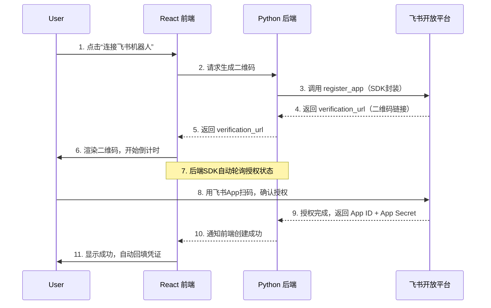

# 飞书机器人扫码连接完整技术实现方案

## 1. 方案概述

飞书开放平台提供了 **“一键创建飞书智能体应用”** 能力，帮助 AI Agent 快速接入飞书。用户只需扫码确认，即可获取 App ID 和 App Secret，直接投入使用。

**传统流程 vs 一键创建流程**：

| 传统方式 | 一键创建方式 |
|---------|------------|
| 用户进入飞书开发者后台手动创建应用 | 用户扫码即可发起创建 |
| 手动配置权限与事件订阅 | SDK自动预置所有必要权限 |
| 手动复制 App ID 和 App Secret | 授权完成后自动返回凭证 |
| 操作繁琐，门槛高 | 三步完成，即扫即用 |

**核心机制**：飞书 SDK 提供的 `register_app` 方法（Python）/ `RegisterApp` 方法（Go），基于 OAuth 2.0 Device Authorization Grant（RFC 8628）协议实现一键创建应用。调用该方法会返回一个验证链接（即二维码内容），用户在飞书中扫码完成授权后，应用自动注册，SDK 返回 App ID 和 App Secret。


## 2. 整体流程



**关键说明**：轮询逻辑由飞书 SDK 在**后端**自动完成，前端只需展示二维码并等待后端的成功通知。


## 3. 后端实现（Python）

### 3.1 安装 SDK

飞书 Python SDK 要求 Python 3.7 及以上：

```bash
pip install lark-oapi -U
```

### 3.2 初始化客户端

首先，你需要在飞书开发者后台创建一个**用于授权调用“一键创建应用”能力的后端服务应用**，获取其 App ID 和 App Secret。

> **注意**：这里的 App ID 和 App Secret 是你的**后端服务自身**的应用凭证，用于授权你的后端去调用“一键创建应用”这个能力，而不是最终用户即将创建的机器人凭证。

```python
import lark_oapi as lark

# 你的后端服务在飞书开放平台上的应用凭证
BACKEND_APP_ID = "cli_xxxxxx"
BACKEND_APP_SECRET = "your_backend_app_secret"

client = lark.Client.builder() \
    .app_id(BACKEND_APP_ID) \
    .app_secret(BACKEND_APP_SECRET) \
    .build()
```

### 3.3 调用 register_app 生成二维码

飞书 Python SDK 提供了 `lark_oapi.register_app` 函数，用于一键创建应用。

```python
import lark_oapi as lark
from flask import Flask, jsonify
import threading
import uuid
import time

app = Flask(__name__)

# 后端服务自身凭证
BACKEND_APP_ID = "cli_xxxxxx"
BACKEND_APP_SECRET = "your_backend_app_secret"

# 存储任务状态：session_id -> {"status": "pending"|"scanning"|"done"|"error", ...}
tasks = {}

def run_registration(session_id, app_preset):
    """在后台线程中执行 register_app"""
    try:
        result = lark.register_app(
            on_qr_code=lambda info: tasks.update({
                session_id: {
                    "status": "scanning",
                    "qr_url": info["url"],
                    "expire_in": info["expire_in"]
                }
            }),
            on_status_change=lambda info: None,  # 可选，用于调试
            app_preset=app_preset
        )
        # 注册成功
        tasks[session_id] = {
            "status": "done",
            "app_id": result["client_id"],
            "app_secret": result["client_secret"]
        }
    except Exception as e:
        tasks[session_id] = {
            "status": "error",
            "error": str(e)
        }

@app.route('/api/feishu/connect', methods=['POST'])
def connect_feishu():
    """发起创建请求，立即返回 session_id"""
    session_id = str(uuid.uuid4())
    
    app_preset = {
        "name": "我的AI助手",
        "desc": "由AI Agent一键创建"
        # "avatar": ["https://example.com/avatar.png"]  # 可选
    }
    
    # 在后台线程中执行注册（避免阻塞请求）
    thread = threading.Thread(
        target=run_registration, 
        args=(session_id, app_preset)
    )
    thread.daemon = True
    thread.start()
    
    # 立即返回 session_id，前端通过轮询获取状态
    return jsonify({
        "session_id": session_id,
        "message": "二维码生成中，请稍后轮询状态"
    })

@app.route('/api/feishu/status/<session_id>', methods=['GET'])
def get_status(session_id):
    """前端轮询此接口获取注册状态"""
    task = tasks.get(session_id)
    if not task:
        return jsonify({"status": "not_found"}), 404
    
    # 如果是 scanning 状态，返回二维码信息
    if task.get("status") == "scanning":
        return jsonify({
            "status": "scanning",
            "qr_url": task.get("qr_url"),
            "expire_in": task.get("expire_in")
        })
    
    return jsonify(task)
```

> **生产环境建议**：使用 Redis 替代内存字典存储任务状态，并考虑使用 Celery 等任务队列替代 threading。

### 3.4 关于 register_app 的阻塞特性

`lark.register_app()` 是**同步阻塞**的，会一直等待用户完成扫码授权或超时。因此：

- 在 Web 框架（如 Flask）中，不应在请求线程中直接调用，否则会阻塞请求。
- 推荐采用**后台任务**（如上述示例中的线程）执行，并通过轮询或 WebSocket 将结果推送给前端。


## 4. 前端实现（React）

前端职责：**发起请求 → 展示二维码 → 轮询状态 → 处理结果**。

### 4.1 安装依赖

```bash
npm install qrcode.react
```

### 4.2 核心组件

```jsx
import React, { useState, useEffect, useRef } from 'react';
import QRCode from 'qrcode.react';

function FeishuConnect() {
  const [status, setStatus] = useState('idle'); // idle | loading | scanning | done | error
  const [qrUrl, setQrUrl] = useState('');
  const [expireIn, setExpireIn] = useState(0);
  const [countdown, setCountdown] = useState(0);
  const sessionIdRef = useRef(null);
  const pollTimerRef = useRef(null);
  const countdownTimerRef = useRef(null);

  // 清理定时器
  useEffect(() => {
    return () => {
      if (pollTimerRef.current) clearInterval(pollTimerRef.current);
      if (countdownTimerRef.current) clearInterval(countdownTimerRef.current);
    };
  }, []);

  const startPolling = (sessionId) => {
    if (pollTimerRef.current) clearInterval(pollTimerRef.current);
    
    pollTimerRef.current = setInterval(async () => {
      try {
        const res = await fetch(`/api/feishu/status/${sessionId}`);
        const data = await res.json();
        
        if (data.status === 'scanning') {
          // 首次获取到二维码
          if (!qrUrl) {
            setQrUrl(data.qr_url);
            setExpireIn(data.expire_in || 600);
            setCountdown(data.expire_in || 600);
            setStatus('scanning');
            startCountdown(data.expire_in || 600);
          }
        } else if (data.status === 'done') {
          // 创建成功！
          clearInterval(pollTimerRef.current);
          clearInterval(countdownTimerRef.current);
          setStatus('done');
          // 自动回填凭证到表单（根据实际业务逻辑处理）
          console.log('App ID:', data.app_id);
          console.log('App Secret:', data.app_secret);
          // TODO: 自动保存凭证，完成配置
        } else if (data.status === 'error') {
          clearInterval(pollTimerRef.current);
          clearInterval(countdownTimerRef.current);
          setStatus('error');
        }
      } catch (error) {
        clearInterval(pollTimerRef.current);
        setStatus('error');
      }
    }, 2000); // 每2秒轮询一次
  };

  const startCountdown = (seconds) => {
    if (countdownTimerRef.current) clearInterval(countdownTimerRef.current);
    countdownTimerRef.current = setInterval(() => {
      setCountdown(prev => {
        if (prev <= 1) {
          clearInterval(countdownTimerRef.current);
          clearInterval(pollTimerRef.current);
          setStatus('expired');
          return 0;
        }
        return prev - 1;
      });
    }, 1000);
  };

  const handleConnect = async () => {
    setStatus('loading');
    try {
      const res = await fetch('/api/feishu/connect', { method: 'POST' });
      const data = await res.json();
      
      if (data.session_id) {
        sessionIdRef.current = data.session_id;
        startPolling(data.session_id);
        // 等待后端生成二维码，轮询会拿到 scanning 状态
      } else {
        setStatus('error');
      }
    } catch (error) {
      setStatus('error');
    }
  };

  const formatTime = (seconds) => {
    const mins = Math.floor(seconds / 60);
    const secs = seconds % 60;
    return `${mins}:${secs.toString().padStart(2, '0')}`;
  };

  return (
    <div style={{ textAlign: 'center', padding: '20px' }}>
      {status === 'idle' && (
        <button onClick={handleConnect} style={{ padding: '12px 24px', fontSize: '16px' }}>
          🔗 连接飞书机器人
        </button>
      )}

      {status === 'loading' && (
        <p>⏳ 正在生成二维码...</p>
      )}

      {status === 'scanning' && (
        <div>
          <div style={{ background: 'white', padding: '16px', display: 'inline-block', borderRadius: '8px' }}>
            <QRCode value={qrUrl} size={200} />
          </div>
          <p style={{ marginTop: '16px' }}>
            📱 请使用飞书App扫描二维码
            <br />
            <span style={{ fontSize: '14px', color: '#666' }}>
              二维码有效期：{formatTime(countdown)}
            </span>
          </p>
          <p style={{ fontSize: '13px', color: '#999' }}>
            扫码后将在手机上引导你创建或连接机器人
          </p>
        </div>
      )}

      {status === 'expired' && (
        <div>
          <p>⏰ 二维码已过期</p>
          <button onClick={handleConnect}>重新生成</button>
        </div>
      )}

      {status === 'done' && (
        <div style={{ color: '#52c41a' }}>
          <p>✅ 飞书机器人创建成功！</p>
          <p style={{ fontSize: '14px', color: '#666' }}>
            凭证已自动配置，可直接使用
          </p>
        </div>
      )}

      {status === 'error' && (
        <div style={{ color: '#ff4d4f' }}>
          <p>❌ 连接失败，请重试</p>
          <button onClick={handleConnect}>重试</button>
        </div>
      )}
    </div>
  );
}

export default FeishuConnect;
```


## 5. 关键技术细节

### 5.1 SDK 自动预置的权限

通过 `register_app` 一键创建的应用，会自动预置 AI 智能体所需的常用权限和事件订阅，包括：

- **机器人能力**：单聊、群聊中收发消息
- **文档评论**：在文档评论中 at 智能体，智能体可回复
- **群组管理**：订阅机器人进群、出群事件
- **消息权限**：读取群组中 @ 机器人的消息、单聊消息等

用户扫码确认时，可以在手机上看到这些权限列表并确认。

### 5.2 预设应用信息

调用 `register_app` 时可以通过 `app_preset` 参数预设应用信息：

```python
app_preset={
    "name": "{user}'s AI助手",  # {user} 会被替换为用户名
    "desc": "由AI Agent一键创建",
    "avatar": ["https://example.com/avatar.png"]  # 支持1-6个头像
}
```

用户在手机上可以看到这些预设信息，并可以修改确认。

### 5.3 凭证安全

- `App Secret` 是敏感信息，**绝不能**存储在前端或暴露给客户端
- 所有与飞书 SDK 的交互在 Python 后端完成
- 凭证返回后应加密存储（如数据库加密字段）

### 5.4 超时处理

- 二维码链接有效期为 **10 分钟**，仅支持一位用户使用
- SDK 的 `register_app` 支持通过 `context` 控制超时
- 前端应实现倒计时，超时后提示用户刷新


## 6. 参考资料

- 飞书开放平台：[一键创建飞书智能体应用](https://open.feishu.cn/document/mcp_open_tools/integrating-agents-with-feishu/overview)
- 飞书 Go SDK：[一键创建应用（Go）](https://open.feishu.cn/document/mcp_open_tools/integrating-agents-with-feishu/create-an-app-in-one-click-go)
- 飞书 Python SDK：[GitHub - larksuite/oapi-sdk-python](https://github.com/larksuite/oapi-sdk-python)
- 飞书 Python SDK：[开发前准备](https://open.feishu.cn/document/server-side-sdk/python--sdk/preparations-before-development)


## 7. 总结

| 对比项 | 之前的不准确方案 | 本方案 |
|--------|-----------------|--------|
| 实现方式 | 猜测 API 端点，手动实现 OAuth | 使用飞书官方 SDK |
| 凭证获取 | 声称通过 OAuth 返回 app_secret | SDK 封装后返回，安全可靠 |
| 轮询逻辑 | 前端手动轮询 | SDK 后端自动处理 |
| 权限配置 | 无 | SDK 自动预置 |
| 官方支持 | 无 | 飞书官方文档背书 |

本方案完全基于飞书官方 SDK 和官方文档，安全可靠，可直接用于生产环境。
